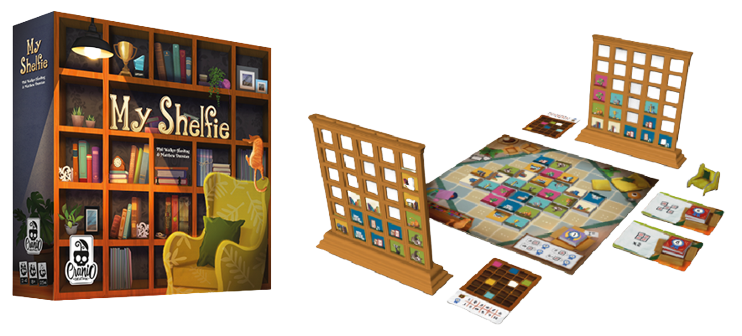

#### ing-sw-2023-pontiggia-pasini-reffo-perriello

# [My Shelfie](https://www.craniocreations.it/prodotto/my-shelfie) - Board game by Cranio



## Description

The project consists of implementing a distributed system, in Java, composed of a single server capable of handling only one game and multiple connected clients (from 2 to 4). 
Each client can participate in only one game at a time, but the same computer can host multiple clients simultaneously. 
The MVC (Model-View-Controller) design pattern has been used, and the network connection is managed through both Socket and RMI (Remote Method Invocation). 
Clients can independently choose to use either of them as games between different technologies are supported. 
Interactions and gameplay can take place through a command-line interface (CLI) and a graphical user interface (GUI).

## Working group - GC22
- [Elia pontiggia](https://github.com/pontig) - 10716792

  Email: elia.pontiggia@mail.polimi.it
  
- [Tommaso Pasini](https://github.com/TommiPasi) - 10717211

  Email: tommaso1.pasini@mail.polimi.it
  
- [Tommaso Reffo](https://github.com/tommymmo) - 10787027

  Email: tommaso.reffo@mail.polimi.it
  
- [Maurizio Perriello](https://github.com/MaurizioPerriello16) - 10739075

  Email: maurizio.perriello@mail.polimi.it
  
## Project requirements

Here you can find the complete specifications: [Project Requirements](game_materials/project_requirement.pdf)

| Functionality                       | State                                                    |
| :---                                | :---:                                                    |
| Basic Rules                         |  |
| Complete rules                      |  |
| Socket                              |  |
| RMI                                 |  |
| CLI                                 |  |
| GUI                                 |  |
| Chat                                |  |
| Server persistence                  |  |
| Resilience to client disconnections |  |
| Multiple parallel matches           |  |

Legend:

 - implemented

 - work in progress

 - not implemented

## Documentation
**UML - (Unified Modeling Language)**
- [Class Diagram](deliveries/UML/Class_Diagram)                 
- [Sequance Diagram](deliveries/UML/Sequence_Diagram)              

**JavaDOC**

The documentation includes descriptions for the majority of the utilized classes and methods, following Java's documentation techniques. 
It can be accessed either by generating it from the code or by visiting [JavaDOC](https://pontig.github.io/ing-sw-2023-pontiggia-pasini-reffo-perriello/deliveries/JavaDoc)       

**[Test Coverage](deliveries/Test_Coverage/coverage.png)** - (Server side)
- [Model Test](src/test/java/it/polimi/ingsw/model)
- [Controller Test](src/test/java/it/polimi/ingsw/controller)
- [Tool generated report](https://pontig.github.io/ing-sw-2023-pontiggia-pasini-reffo-perriello/deliveries/Test_Coverage)

**Libraries and Plugins** 
| Library/Plugin                     | Description                                                            |
| :---                               | :---                                                                   |
| [Maven](https://maven.apache.org/) | Build automation tool primarily used for Java projects                 |
| [JavaFX](https://openjfx.io/)      | Graphic library to create user interfaces (more innovative than Swing) |
| [JUnit](https://junit.org/junit5/) | Unit testing framework                                                 |

## Run the game

**1. Java**

To run the game you need a runtime environment for applications written in the Java language:

- [_Install Java Runtime Environment (JRE)_](https://www.java.com/it/download/manual.jsp) - Choose the right version for your Operating System
- [_Install Java Development Kit (JDK)_](https://www.oracle.com/java/technologies/downloads/) - Choose the right version for your Operating System

Upon successfully installing Java Runtime Environment (JRE) and Java Development Kit (JDK) on your personal computer, you can verify its proper installation by entering the following command in the terminal:
```bash
java -version
```

**2. JavaFX**

To visualize the graphical user interface (GUI) properly, you could need command-line tools and technologies that allow you to develop expressive content for applications deployed to browsers, desktops, and mobile devices:

- [_Download JavaFX Software Development Kit (SDK)_](https://gluonhq.com/products/javafx/) - Choose the right version for your Operating System

**3. Run locally** - (Work on Windows for sure)

Create a folder called 'MyShelfie' and put inside:

&emsp; i. The JAR file from the [artifacts' folder](artifacts)               

&emsp; **My Shelfie Server:**

&emsp;&ensp; Open a terminal and change directory till you are in MyShelfie folder.

&emsp;&ensp; Now you can start the server by typing:
```bash
java -jar Server.jar 
```

&emsp; **My Shelfie Client:**

&emsp;&ensp; Open a second terminal and change the directory till you are in MyShelfie folder.

&emsp;&ensp; Now you can start the client by typing:
```bash
java -jar Client.jar
```

**Issues you could encounter**

&emsp; *In all the operating systems* - If you can not visualize correctly the images when playing on GUI

Inside the folder 'MyShelfie' created before, insert:

&emsp;&nbsp;i. The SDK folder that can be downloaded following the instruction in the previous section (unzip it if necessary)

&emsp; **My Shelfie Server:**

&emsp;&ensp; Run it as before

&emsp; **My Shelfie Client:**

&emsp;&ensp; Open a second terminal and change the directory till you are in MyShelfie folder.

&emsp;&ensp; Now you can start the client by typing:
```bash
java --module-path <Name of SDK folder>/lib --add-modules javafx.controls,javafx.fxml -jar Client.jar
```
```bash
#Remember to change <Name of SDK folder> (it should be something like 'javafx-sdk-20.0.1')
```

&emsp; *A -* Windows
- If you are utilizing Windows 10 or a later version, you may encounter difficulties in properly rendering ANSI colors when using the command-line interface (CLI).
  To resolve this issue, please execute the following command in the terminal:
  
  ```bash
  reg add HKCU\Console /v VirtualTerminalLevel /t REG_DWORD /d 1
  ```
- If you want to open multiple client on the same machine, and more then one playing through CLI, before starting each 'Client.jar', you must open and additional terminal for each of them that will use CLI and follow this:
  
  &ensp; **My Shelfie Client Chat on CLI:**
  
  &ensp; In the second terminal change the directory till you are in MyShelfie folder.

  &ensp; Now you can start the client chat by typing:
  ```bash
  java -jar TerminalServer.jar
  ```
  &ensp; In the file 'port.txt' in 'MyShelfie' folder you must press enter key after the port number, before starting a new 'TerminalServer.jar'
  

&emsp; *B -* Linux
- No issues found yet
  
&emsp; *C -* MacOS
- We were unable to test it as such a machine was not available

## How to play
- [Written rules](game_materials/rules)
- [Video rules](https://www.youtube.com/watch?v=BNzV1NHd-To&t=75s) - [ITA]
- When using GUI version:
  -  To open the chat terminal press on the keyboard:`
     ```bash
     T
     ```
  - To close the chat terminal press on the keyboard:`
     ```bash
     esc
     ```
- To use the 'Server persistence Functionality' on a server crash:
  - If you want to reload the game:
    1. Start the server again
    2. Start the client and enter the same nicknames as the previous match
  - Otherwise:
    1. Delete file 'status.json' from MyShelfie folder

## Other info
- Supervisor: [Prof. G. Cugola](https://cugola.faculty.polimi.it/)
- Grade: - / 30 cum laude

> **_NOTA_**: My Shelfie è un gioco da tavolo sviluppato ed edito da Cranio Creations Srl. I contenuti grafici di questo progetto riconducibili al prodotto editoriale da tavolo sono utilizzati previa approvazione di Cranio Creations Srl a solo scopo didattico. È vietata la distribuzione, la copia o la riproduzione dei contenuti e immagini in qualsiasi forma al di fuori del progetto, così come la redistribuzione e la pubblicazione dei contenuti e immagini a fini diversi da quello sopracitato. È inoltre vietato l'utilizzo commerciale di suddetti contenuti. 

